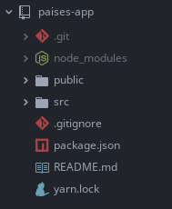

# Primeros Pasos

###### Creación del Proyecto

Lo primero que vamos a hacer es crear el proyecto, y para esto nos dirigimos a un directorio donde queremos crearlo y corremos:

```shell
npx create-react-app paises-app
cd paises-app
npm start
```

[^Nota]: **npx** es una herramienta para correr paquetes que viene con **npm 5.2+**.

Con `create-react-app` creamos un proyecto que se llamará `paises-app`, el cual ya esta preparado para el desarrollo con las ultimas características de `JavaScript` y optimizado para producción. 

El directorio debería verse así:



Con `cd paises-app` ingresamos al directorio donde se encuentra nuestra aplicación y con `npm start` creamos una `build` de desarrollo que podamos ver en el navegador ingresando en http://localhost:3000/, aquí podremos ver que la misma funciona correctamente.

Para terminar la ejecución de la `build` de desarrollo presionamos `Ctrl+C`.

[Preparar el Proyecto](./2-Preparar el Proyecto.md)

